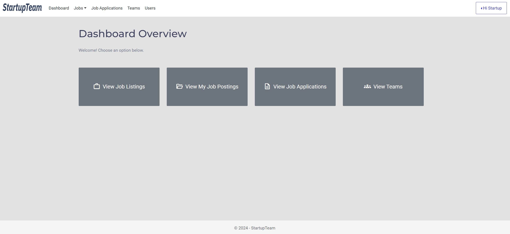
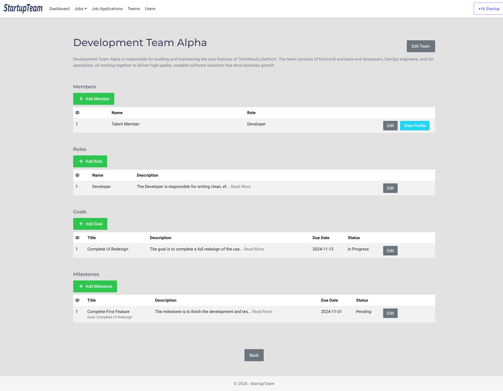
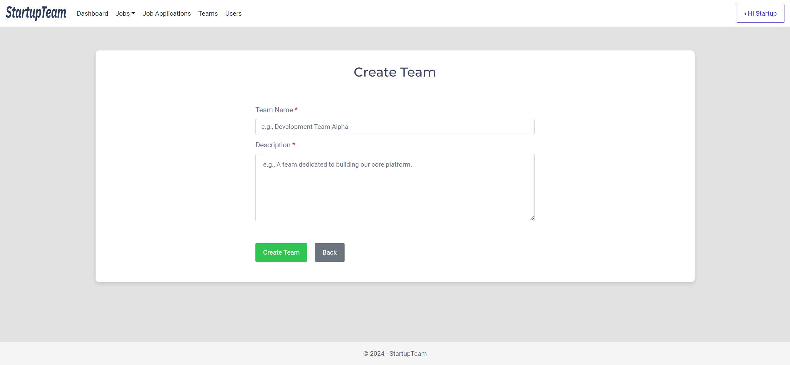
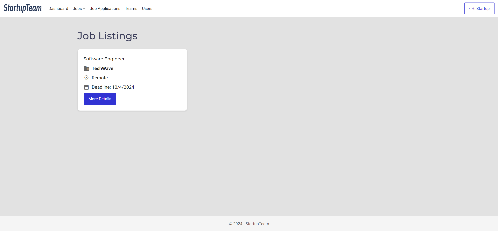
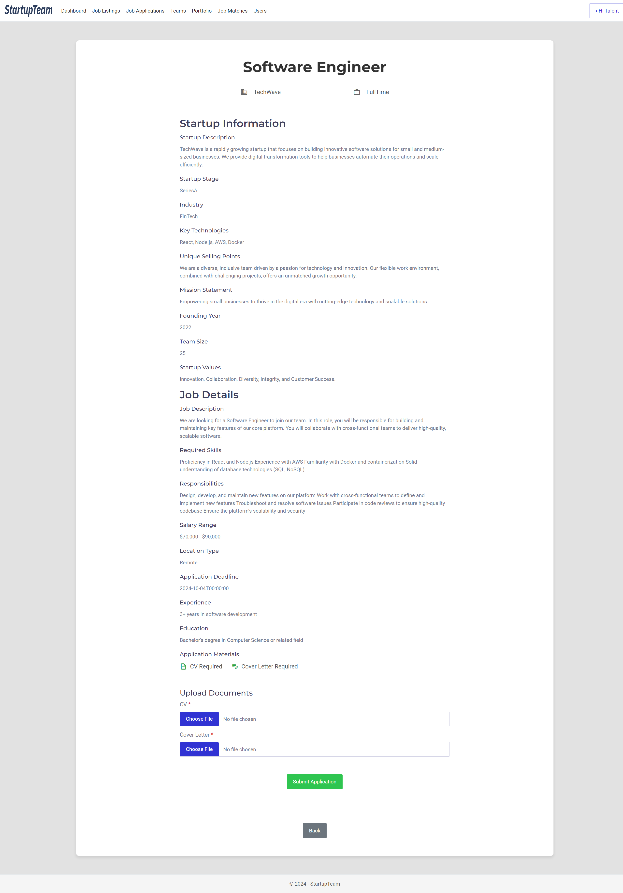

# Thesis (Individual-Project-Module)
## Title: Technology-based Startup Team Organization Platform

## Project Description

### 1.2 Aims and Objectives

The platform aims to serve as a central hub for the tech startup community, enabling startup founders to assemble and manage well-organized teams effectively. Additionally, skilled individuals can showcase their skills and portfolio to demonstrate their capabilities and join startup teams. This addresses the practical challenge of designing and implementing a unified platform that organizes tech startup teams by combining recruitment and team management features, facilitating expert matching, and creating a talent pool of skilled professionals.

The project objectives are as follows:

- **Objective 1:** To enable startup founders to organize startup teams by hiring skilled individuals.  
  **Test:** Evaluate the usability and effectiveness of the job posting and team formation features through user feedback.

- **Objective 2:** To enable skilled individuals to showcase their portfolios and join startup teams.  
  **Test:** Assess the ease of portfolio sharing and the impact of the hiring process through user feedback.

- **Objective 3:** To match suitable skilled individuals to startup job postings and assist founders in finding the right talent.  
  **Test:** Measure the accuracy of the matching algorithm along with user feedback.

- **Objective 4:** To facilitate startup team management through goal setting, milestone tracking, role definitions, and task management.  
  **Test:** Evaluate the clarity and usability of goal setting, milestone tracking, role definitions, and task management features through user feedback.

> These objectives have been refined from the initial proposed ones to focus on core aspects essential for the timely delivery of the project within the given timeframe and successful completion.

## System Architecture

The platform follows a **Modular Monolith Architecture**:

- **Backend:** ASP.NET Core, organized in modules for User Management, Portfolio Management, Job Management, and Team Management.  
- **Frontend:** React.js, providing a responsive and dynamic user interface for both startup founders and skilled individuals.  

This modular monolith approach allows us to maintain a single deployable unit while separating concerns internally for scalability and maintainability.

## Project Structure

The current source code folder contains the following directories:

- **Backend**: ASP.NET Core backend project.  
- **Deployment Configurations**: YAML configuration files for Kubernetes.  
- **Frontend**: React app for the platform.  
- **Matching-Algorithm**: Matching algorithm integrated into the backend, with additional tests in this folder.  

## Test Accounts

**Startup Founder Account**  
- Username: founder_test@example.com  
- Password: TestP@ss123  

**Skilled Individual Account**  
- Username: individual_test@example.com  
- Password: TestP@ss123  

## Running the Platform Locally

### Frontend

1. Navigate to the folder `\frontend\startupteam`.  
2. Open a terminal or console in that directory.  
3. Install dependencies:  
   ```bash
   npm instal
4. Start the frontend application:
   ```bash
   npm start
The app will run on your localhost.

> **Note:** The `node_modules` folder has been removed to reduce submission size. Ensure you run `npm install` before starting the frontend.

### Backend

1. Navigate to the folder `\backend\StartupTeam`.
2. Open the solution file `StartupTeam.sln` in Visual Studio.
3. Click the Run button to start the backend.
By default, the backend connects to the Azure SQL database hosted in the cloud.

#### Connecting to a Local SQL Server Database
1. Navigate to `\backend\StartupTeam\StartupTeam.Api` and open `appsettings.json`.
2. Change the value of `"ConnectionStrings:DefaultConnection"` to your local SQL Server connection string.

#### Applying Entity Framework Core Migrations
1. Open Command Prompt and navigate to `\backend\StartupTeam`.
2. Run the following commands for each module:
   ```bash
   dotnet ef database update --project ./Modules/StartupTeam.Module.UserManagement --startup-project ./StartupTeam.Api --context UserManagementDbContext
   
   dotnet ef database update --project ./Modules/StartupTeam.Module.PortfolioManagement --startup-project ./StartupTeam.Api --context PortfolioManagementDbContext
   
   dotnet ef database update --project ./Modules/StartupTeam.Module.JobManagement --startup-project ./StartupTeam.Api --context JobManagementDbContext
   
   dotnet ef database update --project ./Modules/StartupTeam.Module.TeamManagement --startup-project ./StartupTeam.Api --context TeamManagementDbContext

### Running Tests

#### Backend Tests
1. Navigate to `\backend\StartupTeam`.
2. Open `StartupTeam.sln` in Visual Studio.
3. Select the `StartupTeam.Tests` project in Solution Explorer.
4. From the Test menu, select Run All Tests.
5. All tests should pass. Results can be viewed in the Test Explorer.

#### Frontend Tests
1. Navigate to the folder `\frontend\startupteam` in Visual Studio Code.
2. From the Testing menu, select Run All Tests.
3. All tests should pass successfully.

#### Matching Algorithm (Standalone)
1. Navigate to the folder `\matching-algorithm`.
2. Open the solution file `Solution1.sln` in Visual Studio.
3. Click the Run button. The console application will display the results.

### Diagrams and Screenshots
The following diagrams and screenshots illustrate the platform's design and functionality:
#### [Use Case Diagram](screenshots/Use%20Case%20Diagram.png)
#### [Class Diagram](screenshots/Class%20Diagram.png)
#### [Sequence Diagrams](screenshots/Sequence-Diagrams)
#### [Deployment Diagram](screenshots/Deployment%20Diagram.png)
#### [Wireframes](screenshots/Wireframes)
#### [Screenshots](screenshots/Platform)

Here are some screenshots of the platform:
1. **Founder - Dashboard**<br/>
  

2. **Founder - Team Management**<br/>
  

3. **Founder - Team Creation**<br/>
  
  
4. **Individual - Job Listings**<br/>
  

5. **Individual - Job Posting**<br/>
  

6. **Individual - Job Matches**<br/>
  

## Project Report

For a detailed report on the project, including design, implementation, testing, and evaluation, please refer to the [full project report](Report.pdf).
